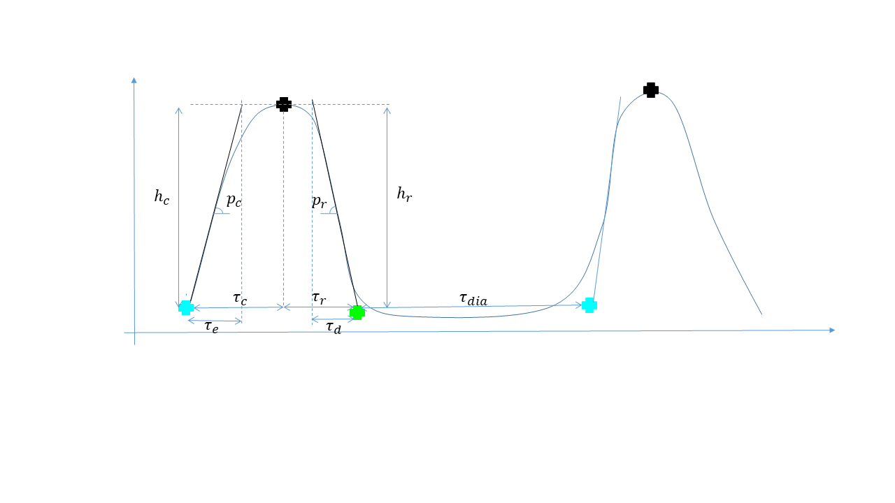

About
=====

Autodyn is a tool initially developped for analyzing the beating characteristics of Cardiomyocytes derived from human IPS cells, but it can be used for many other purposes where some oscillations are monitored on images (for example: heart beating of the zebrafish embryo). 
For an example of the features that can be extracted from this type of analysis, see:

Moreau, A., Reisqs, J. B., Delanoe‐Ayari, H., Pierre, M., Janin, A., Deliniere, A., ... & Chevalier, P. (2021). Deciphering DSC2 arrhythmogenic cardiomyopathy electrical instability: From ion channels to ECG and tailored drug therapy. Clinical and translational medicine, 11(3), e319.

Steps
=========

## Running KLT
Run the file called main file.
Here you can initialize the parameters necessary for the movement tracking and the starting folder.

First, copy paste the name of the directory where the tif files of your movies are stored inside the uigetdir function not to search too long for your path.
Second, give the path of the folder where all your results will be stored (please not the same as the data folder). 
This is the savedir variable (don't forget the "/" or "\" (depending on your system), at the end of the path).
Then a first interface will be launched for making a mask (i.e. creating a binary image defining the area of interest, which will delineate where the next calcululations (displacement field) will be performed on your image).
You can test on a few of your images the effect of the only parameter which control the mask extension  and when you are satisfied you can click on "treat all". This will generate a mask for all the data stored in your initial folder.

When finished, a second interface will be launched (only if you have set the param.auto to 0).
It is important to make some trials before switching param.auto to 1 (which will enable to run the  analysis in batch, without seeing the interface).
Because some of the parameters need to be really selected properly.
Once the klt interface is launched, first click on test points, this will enable to make some red points appear on your images (only below the mask), you can make the number of points appearing vary by changing the potential total number of points and their minimal distance. The effective number of points will be displayed underneath the image.
Be sure you have enough for your statistics.

You can then click on test klt. This will run the algorithm in between the two first images, you can then see the computation time and the results, if everything is ok you can press run klt.
The program will now run on all the images of your movies and save the results, before going to the next one.
This can be long, so if you are satisfied with your first results, cancel the calculation. Copy the values of your parameters in the first part of the program,
and turn the param.auto to one. Then launch everything again, go and do something else, everything will be run in batch.

## Run Fourier Analysis

Run the PeriodicSignalsController.m

## How are parameters of periodic signals calculated?

Let's call S(t) the periodic signal of the average amplitude of the displacement field in a given area.
Let's call Ss(t) a smooothed version of this signal.

The software calculates the derivative of a S and Ss (S' and Ss')and will 
detect the position of the  peaks of the derivatives first on the Ss' then searching around the position on the more accurate S'. 
Then it will search for the maxima  and minima of the S signal in beetween two of these peaks. 

 

## List of calculated parameters for each contraction-relaxation cycle
Here are the different parameters calculated by the software :

pc=slope of the contraction (speed)
pr=slope of the relaxation
hc=height of the contraction
hr=height of the relaxation

tauc=contraction time
taur=relaxation time

Aire=area under the curve
M=maximum of displacement
mmvg= minimum displacement before contraction
mmvd=minimum diplacement after contraction

 Correction de Bazett 
 Cette correction est employée en cardiologie afin de corriger l’effet de la fréquence cardiaque sur la durée de l’activité électrique… en effet, si tu augmentes ton rythme, ton activité doit mécaniquement être plus courte…. et du coup, quand tu veux comparer la durée de l’activité électrique de deux patients ayant un rythme différent, tu corriges pour ce rythme… Les limites sont que la correction n’est efficace que dans une certaine plage de rythme. Ce qui n’est pas nécessairement le cas de nos cellules. J’avais donc voulu faire cette correction car « c’est mieux que rien », mais je sais que ce n’est pas idéal, et il faut donc l’utiliser avec précautions.

tausBaz=taus/sqrt(T)
taudBaz=taud/sqrt(T)

## Other parameters can be calculated afterwards by the user if needed

$\tau_e$ and $\tau_d$ are not explicitely given back by the software
but can be easily calculated afterwards by the user  if needed
$\tau_e=p_c/h_c$ and $\tau_d=p_r/h_r$

In the same way, $\tau_s$ is not now given back by the software, but can easily be calculated as: $\tau_s=\tau_c+\tau_r$